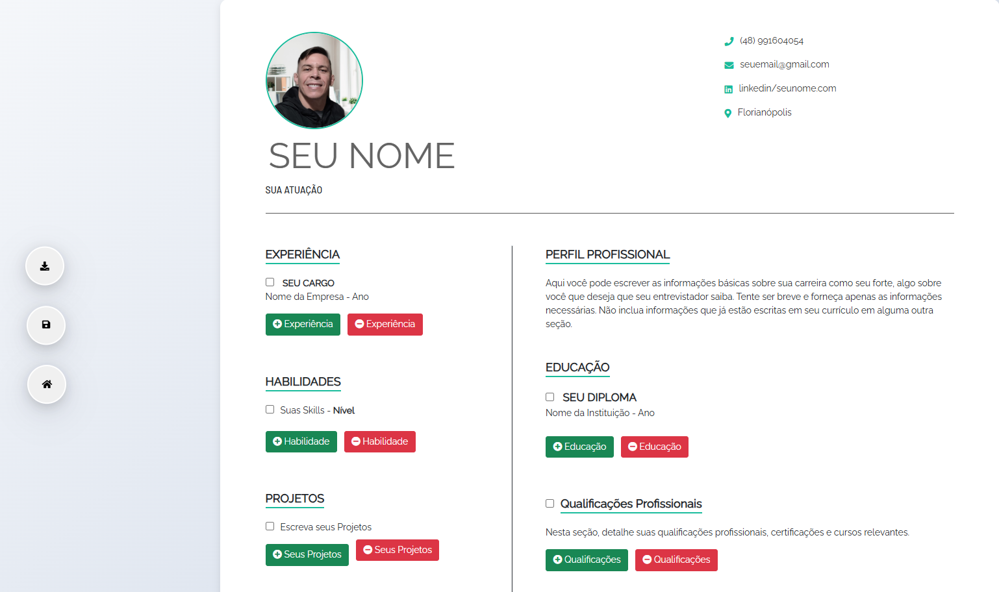

# **Editor de Currículo Moderno**

  
*Imagem ilustrativa do editor de currículo em ação.*

---

## **Descrição**

O **Editor de Currículo Moderno** é uma ferramenta intuitiva e responsiva para criar currículos profissionais diretamente no navegador. Com design moderno, funcionalidades avançadas e excelente usabilidade, este editor permite que você personalize seu currículo com facilidade, adicione uma foto de perfil, organize suas experiências, habilidades, projetos e muito mais.

Recursos principais:
- **Responsividade**: Funciona perfeitamente em dispositivos móveis, tablets e desktops.
- **Download em PDF**: Gere seu currículo em formato PDF com apenas um clique.
- **Upload de Imagem**: Adicione sua foto de perfil com suporte para arrastar e soltar.
- **Campos Editáveis**: Todos os campos são editáveis, permitindo personalização completa.
- **Reset Completo**: Limpe todos os campos com um único botão.
- **Design Moderno**: Interface limpa e profissional com cores suaves e tipografia elegante.

---

## **Instruções de Uso**

### **1. Configuração Inicial**
1. Clone ou baixe este repositório para sua máquina local.
2. Abra o arquivo `index.html` em qualquer navegador moderno (Google Chrome, Firefox, etc.).
3. O editor estará pronto para uso imediatamente.

### **2. Personalizando o Currículo**
- **Nome e Atuação**: Clique nos campos "SEU NOME" e "SUA ATUAÇÃO" para editar.
- **Foto de Perfil**: Clique na imagem de perfil ou arraste e solte uma nova imagem.
- **Contatos**: Edite os campos de telefone, e-mail, LinkedIn e localização.
- **Seções**: Use os botões "+" e "-" para adicionar ou remover itens nas seções de Experiência, Habilidades, Projetos, Idiomas e Educação.

### **3. Baixando o Currículo**
- Clique no botão de download (`<i class="fas fa-download"></i>`) para gerar o currículo em PDF.
- O PDF será salvo automaticamente no seu dispositivo.

### **4. Resetando o Currículo**
- Clique no botão de reset (`<i class="fas fa-undo"></i>`) para limpar todos os campos e começar novamente.

---

## **Funcionalidades do Código**

### **1. Funções Principais**
- **Adicionar/Remover Seções**: Use funções como `addExp()`, `remExp()`, `addLang()`, `remLang()` para gerenciar dinamicamente as seções do currículo.
- **Salvar Progresso**: A função `saveresume()` salva o conteúdo atual do currículo para evitar perda de dados.
- **Responsividade Dinâmica**: A função `updateMobileView()` ajusta o layout para diferentes tamanhos de tela.

### **2. Upload de Imagem**
- O código suporta upload de imagem via `<input type="file">` ou arrastar e soltar.
- A função `FileReader` é usada para carregar a imagem selecionada.

### **3. Impressão e Download**
- A biblioteca `html2pdf.js` é usada para converter o currículo em PDF.
- Antes da impressão, os botões e checkboxes são ocultados para garantir um layout limpo.

---

## **Estrutura do Projeto**

```
/projeto-cv
│
├── index.html          # Arquivo principal HTML
├── styles.css          # Estilos CSS para o design
├── script.js           # Lógica JavaScript para funcionalidades
├── img/                # Pasta para imagens (como ícones ou placeholders)
└── README.md           # Este arquivo README
```

---

## **Funcionalidades Futuras**

Planejamos adicionar ainda mais recursos ao editor de currículo:
- **Modelos de Currículo**: Escolha entre diferentes layouts predefinidos.
- **Validação de Campos**: Alertas para campos obrigatórios não preenchidos.
- **Dark Mode**: Alternar entre modos claro e escuro.
- **Armazenamento Local**: Salve seu progresso automaticamente no navegador.

---

## **Contato**

Entre em contato comigo através dos links abaixo:

[](https://api.whatsapp.com/send?phone=+5548991604054)  
[](https://www.linkedin.com/in/alexandre-liberato-32179624b/)  
[](mailto:alexandreliberatto@gmail.com)

---

## **Créditos**

- **Font Awesome**: Ícones utilizados no projeto ([Font Awesome](https://fontawesome.com/)).
- **Google Fonts**: Fontes Raleway e Barlow ([Google Fonts](https://fonts.google.com/)).
- **HTML2PDF**: Biblioteca para geração de PDFs ([HTML2PDF](https://github.com/eKoopmans/html2pdf.js)).

---

## **Licença**

Este projeto está licenciado sob a [MIT License](https://opensource.org/licenses/MIT).  
Você pode usar, modificar e distribuir este software livremente.
